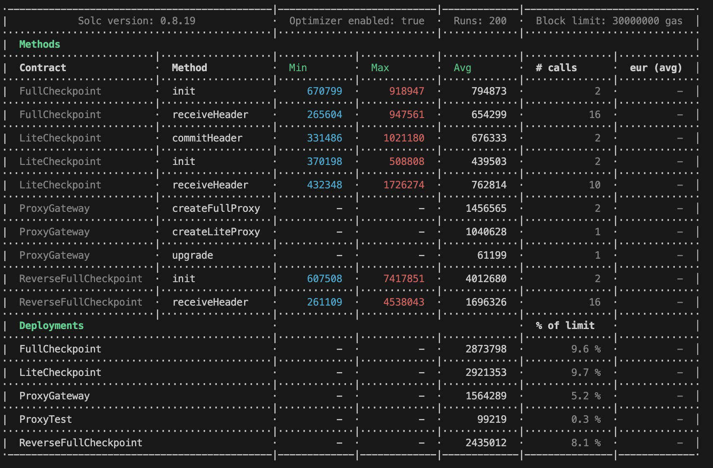

# XDC Checkpoint Smart Contract

This repository contains scripts for building, testing, and deploying the XDC checkpoint smart contract. Follow the guide below to get started.

## Prerequisites

Ensure you have Node.js version 20 or higher installed on your system.

## Contract Building and Testing

### Setting up the Environment

1. **Install Dependencies**
   Install the necessary dependencies using yarn:

   ```shell
   yarn
   ```

2. **Testing**
   Compile and test the contract using the following commands:

   ```shell
   npx hardhat test
   ```

## Contract Setup

We recommend setting up the contract in a Python virtual environment since it utilizes the web3 library adapted for XDC. Before beginning, carry out these two steps:

1. **Configuration**

   Complete the fields in `deployment.config.json`:

   - `subnet`: subnet deploy config :
     - `validators`: List of initial validator addresses
     - `gap`: GAP block number on the public chain
     - `epoch`: Blocks per epoch on the public chain
     - `gsbn`: gap start block number, gap block required
   - `parentnet`: Subnet deploy config :
     - `epoch`: Blocks per epoch on the public chain
     - `v2esbn`: V2 epoch start block number, epoch block required

**How to Obtain gsbn in the Subnet**

The gap block in the subnet follows a regular pattern. By adding 451 to each multiple of 900, you get the GSBN. For example, 451, 1351, etc.

**How to Obtain v2esbn in the Parentnet**

The epoch number in the parentnet is unpredictable, but you can obtain the latest epoch number using the following command:

```sh
curl --location '${parentnet}' \
--header 'Content-Type: application/json' \
--data '{
    "jsonrpc": "2.0",
    "method": "XDPoS_getMissedRoundsInEpochByBlockNum",
    "params": [],
    "id": 1
}'
```

   Configure your network in `network.config.json`:

   - `xdcparentnet`: xdcparentnet RPC URL
   - `xdcsubnet`: xdcsubnet RPC URL

2. **Environment Variables**

   Create a `.env` file containing a valid account private key (refer to `.env.sample` for an example).

## Contract Deployment

Deploy the contract and obtain the deployed contract address as follows:

1. **Full Checkpoint Deployment**

   ```shell
   npx hardhat run scripts/FullCheckpointDeploy.js --network xdcparentnet
   ```

2. **Lite Checkpoint Deployment**

   ```shell
   npx hardhat run scripts/LiteCheckpointDeploy.js --network xdcparentnet
   ```

3. **Reverse Full Checkpoint Deployment**

   ```shell
   npx hardhat run scripts/ReverseFullCheckpointDeploy.js --network xdcsubnet
   ```

## Additional Commands

For further assistance or to execute other operations, utilize the commands below:

```shell
npx hardhat accounts
npx hardhat compile
npx hardhat clean
npx hardhat test
npx hardhat node
npx hardhat help
REPORT_GAS=true npx hardhat test
npx prettier '**/*.{js,json,sol,md}' --check
npx prettier '**/*.{js,json,sol,md}' --write
npx solhint 'contracts/**/*.sol'
npx solhint 'contracts/**/*.sol' --fix
```

## Gas Report

Refer to the gas report:


## Upgrade Module

To upgrade the module, follow these steps:

1. **Configuration**

   Complete the fields in `upgrade.config.json`:

   - `proxyGateway`: The admin contract managing all proxy contracts.

2. **ProxyGateway Deployment**

   If you don't have a proxyGateway contract, deploy yours using:

   ```shell
   npx hardhat run scripts/proxy/ProxyGatewayDeploy.js --network xdcparentnet
   ```

3. **Upgrading**

   Upgrade the contract using:

   ```shell
   npx hardhat run scripts/proxy/UpgradeCSC.js --network xdcparentnet
   ```

## Important reminder

Because the node might modify the value of `certThreshold` based on the configuration file, when the node makes such modifications, the `certThreshold` in the CSC needs to be hardcoded and upgraded accordingly.
